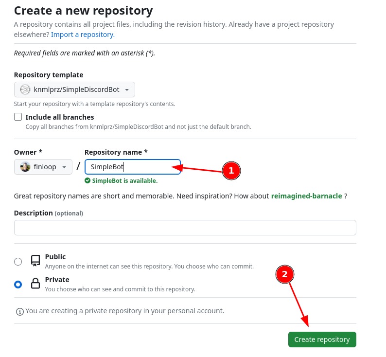
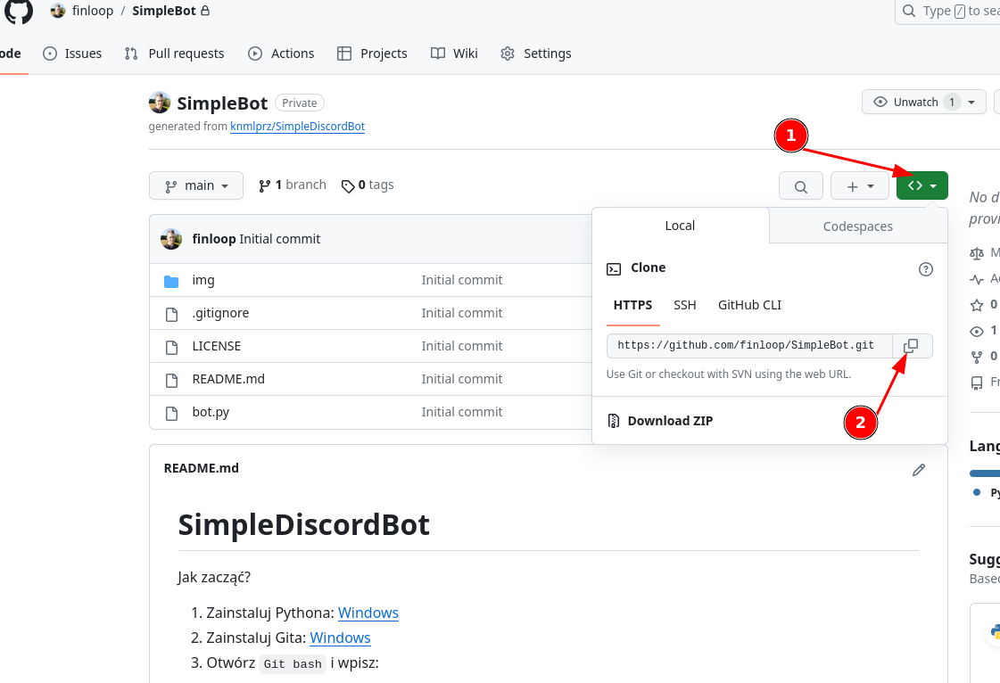
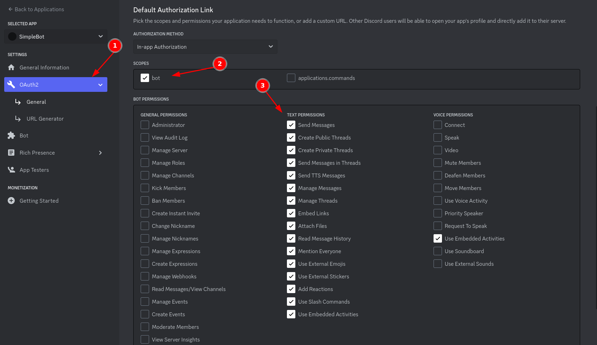
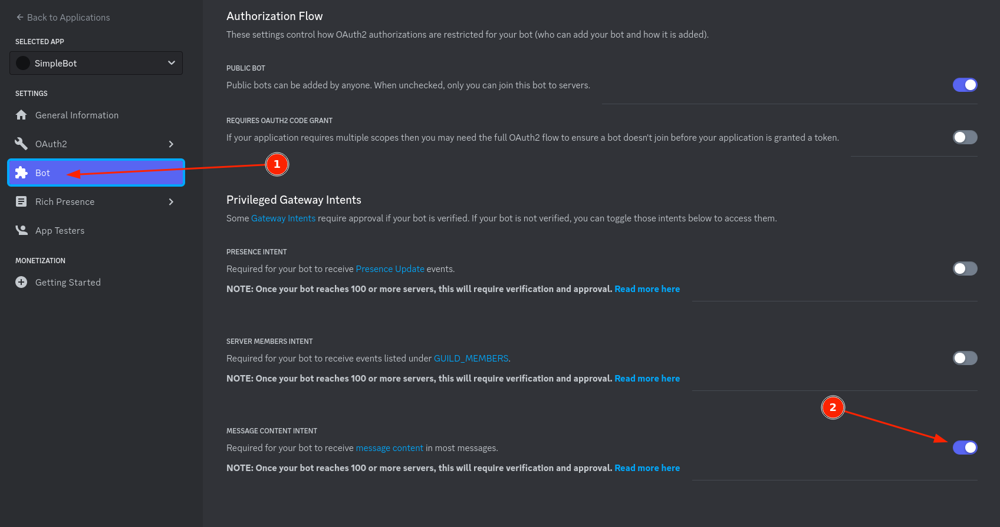
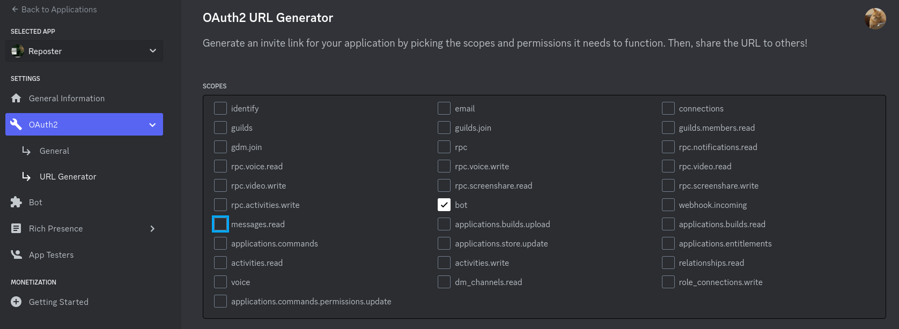
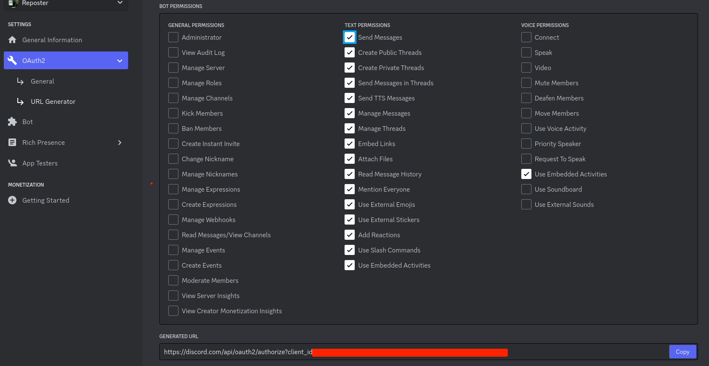
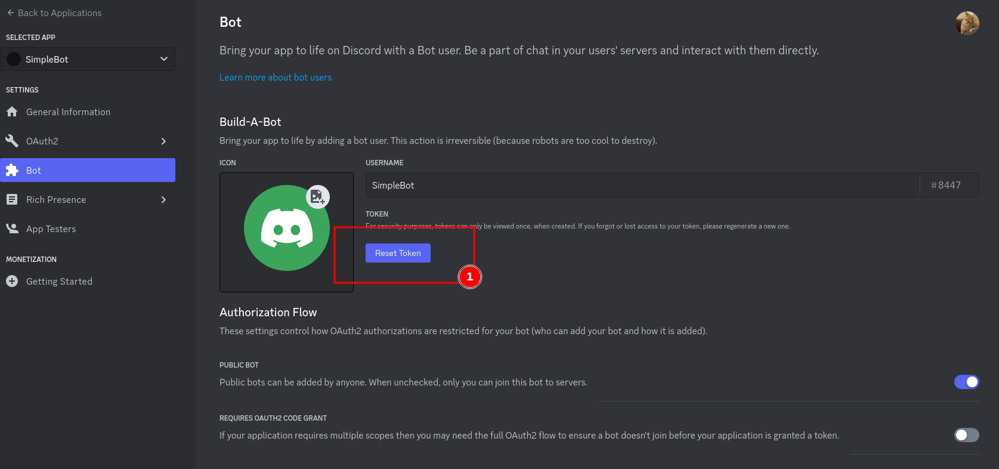
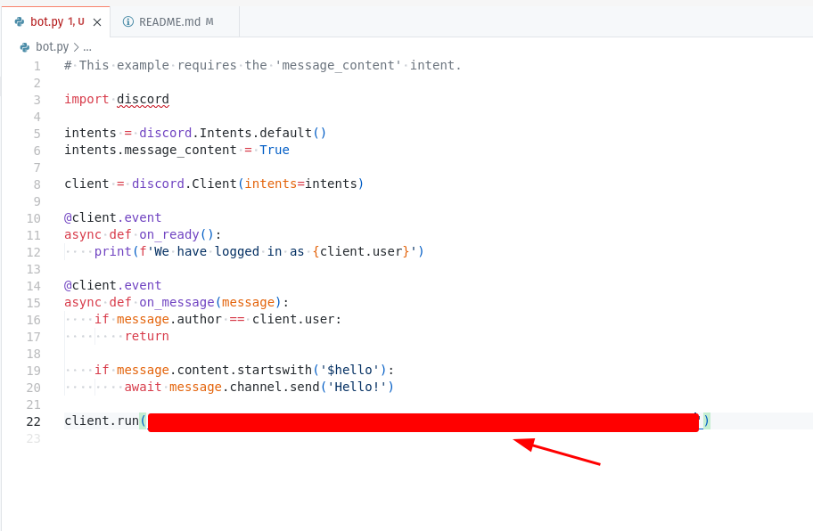

# SimpleDiscordBot

Jak zacząć?

1. Zainstaluj Pythona: [Windows](https://www.python.org/ftp/python/3.11.6/python-3.11.6-amd64.exe)
2. Zainstaluj Gita: [Windows](https://github.com/git-for-windows/git/releases/download/v2.42.0.windows.2/Git-2.42.0.2-64-bit.exe)
3. Stwórz własne repozytorium z template:


Otwórz `Git bash` i wpisz:
```bash
git clone <TU-WKLEJ-SKOPIOWANY-LINK>
```
Przykład poprawnego polecenia:
```bash
git clone https://github.com/finloop/SimpleBot.git
```
4. Otwórz folder `SimpleDiscordBot` np. w Visual Studio Code
5. Otwórz terminal i wpisz (to zainstaluje bibliotekę discord.py):
```bash
py -3 -m pip install -U discord.py
```
7. Załóż własny serwer na discordzie.
8. Otwórz stronę: https://discord.com/developers/docs/getting-started
9. Kliknij -> `Create app`
10. Wpisz nazwę bota i kliknij -> `Create`.
11. Wykonaj kroki z obrazka:




Skopiuj i wejdź w link, aby dodac bota do serwera.

Kliknij `Reset token`. Skopiuj ten token i wklej to do pliku bot.py

12. Wpisz w terminalu:
```bash
py bot.py
```
13. Napisz na czacie swojego serwera `$hello` i zobaćz co się stanie.

Powodzenia! :wink: 